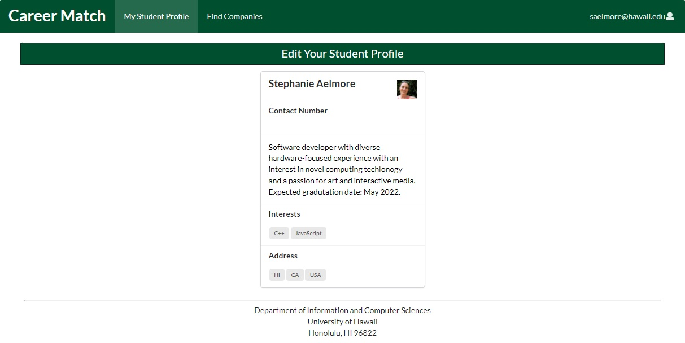

## Table of contents

- [Table of contents](#table-of-contents)
- [Overview](#overview)
- [Deployment](#deployment)
- [User Guide](#user-guide)
  - [Student experience](#student-experience)
  - [Recruiter experience](#recruiter-experience)
  - [Admin experience](#admin-experience)
- [Community Feedback](#community-feedback)
- [Developer Guide](#developer-guide)
- [Development History](#development-history)
  - [Milestone 1: Mockup development](#milestone-1-mockup-development)
  - [Milestone 2: Data model development](#milestone-2-data-model-development)
  - [Milestone 3: Final development](#milestone-3-final-development)
- [Continuous Integration](#continuous-integration)
- [Contact Us](#contact-us)

## Overview 

Career Match provides a new way for connecting companies with a matching system. Students can select their skills to match with companies or browse companies by zip-code to fit their geographic preference. Recruiters can also use the app to explore student profiles with interests and skills that the company is seeking. Students who visit the site can create a profile with their interests (skills), preferred geographic location by zip-code, and contact info. Admins can view and edit all student and company profiles. In this way the site can match students to employers and vice-versa.

The Github Organization for this project can be found [here](https://github.com/career-match/)

## Deployment

The latest version of the app is hosted [here](https://career-match.connectiveunconscious.com)

## User Guide

The landing page is the first page presented to the user. If the user is not logged in, it presents the option to do so.


If the user does not yet have an account, they may register for a new one, where they can select from between the roles of Student or Recruiter.


### Student experience

If the user logs in as a student or creates a student account, they are presented with the student home page.


From this page they may view their student profile or find companies that fit specified criteria. The My Student Profile option allows the user to view their profile as it appears to others.



From here, they can click the Edit Your Student Profile button to add or edit their displayed profile information.


On the Find Companies page, students can browse companies with profiles on the app, and select those that are looking for certain skills or are hiring in specified locations.


### Recruiter experience

If the user logs in as a recruiter or creates a recruiter account, they are presented with the company home page.


From this page they may view their company profile or find students that fit specified criteria. The My Company Profile option allows the user to view their profile as it appears to others.


From here, they can click the Edit Your Company Profile button to add or edit their displayed profile information.


On the Find Students page, recruiters can browse students with profiles on the app, and select those that are promising certain skills or are looking for work in specified locations.


### Admin experience

If the user logs in as admin, they can view and edit all student and company profiles, via the Find Companies and Find Students pages.


## Community Feedback

"Career Match is a useful website to help narrow down my options when looking to work for big corporations. It's helpful as each company is listed with programming languages they are interested in hiring so I could also know what languages to learn if I ever plan to join a company but don't know the language they desire." - Karl Penuliar, UH ICS Student.

## Developer Guide

To build Career Match locally, first clone the career-match repository to your system:  
```bash
$ git clone https://github.com/career-match/career-match.git
```

Career Match uses [Meteor](https://www.meteor.com) which can be installed using npm with the command:  
```bash
$ npm install -g meteor
```

Install the dependencies using:  
```bash
$ cd career-match/app
$ meteor npm install
```

Build the app locally with:  
```bash
$ meteor npm run start
```

To use the locally built app, connect using a web browser to `http://localhost:3000`.

The app is designed to be deployed using [Meteor Up](http://meteor-up.com), which will have to be configured for the particular webserver you wish to host it on.

## Development History

The development process for Career Match conformed to [Issue Driven Project Management](http://courses.ics.hawaii.edu/ics314f19/modules/project-management/) practices. In a nutshell:

Development consists of a sequence of Milestones.
- Each Milestone is specified as a set of tasks.
- Each task is described using a GitHub Issue, and is assigned to a single developer to complete.
- Tasks should typically consist of work that can be completed in 2-4 days.
- The work for each task is accomplished with a git branch named “issue-XX”, where XX is replaced by the issue number.
- When a task is complete, its corresponding issue is closed and its corresponding git branch is merged into master.
- The state (todo, in progress, complete) of each task for a milestone is managed using a GitHub Project Board.

The following sections document the development history of Career Match.

### Milestone 1: Mockup development
The main goal of Milestone 1 was to create a set of HTML pages providing a mockup of the pages in the system.  

Milestone 1 was managed using [GitHub Project Board M1](https://github.com/career-match/career-match/projects/1)

### Milestone 2: Data model development
The main goal of Milestone 2 is to implement the data model: the underlying set of Mongo Collections and the operations upon them that would support the Career Match application.  

Milestone 2 is managed using [GitHub Project Board M2](https://github.com/career-match/career-match/projects/2)  


### Milestone 3: Final development
The main goal of Milestone 3 is to add the remaining functionality to obtain a usable app, and finish implementing tests and updating documentation.

Milestone 3 is managed using [GitHub Project Board M3](https://github.com/career-match/career-match/projects/3) 

## Continuous Integration
[](https://github.com/career-match/career-match/actions/workflows/ci.yml)

Career Match uses GitHub Actions to automatically run ESLint and TestCafe each time a commit is made to the default branch. You can see the results of all recent “workflows” at [https://github.com/career-match/career-match/actions](https://github.com/career-match/career-match/actions).

The workflow definition file is located at `.github/workflows/ci.yml`.

## Contact Us
Career Match was designed and implemented by:
- [Cathy Kim](https://github.com/cathy-kim95)
- [Gerald Lee](https://github.com/glee25)
- [Ian Eshelman](https://github.com/IanEshelman)
- [Jay Ramos](https://github.com/ramosJay)
- [Stephanie Aelmore](https://github.com/believeinlain)
