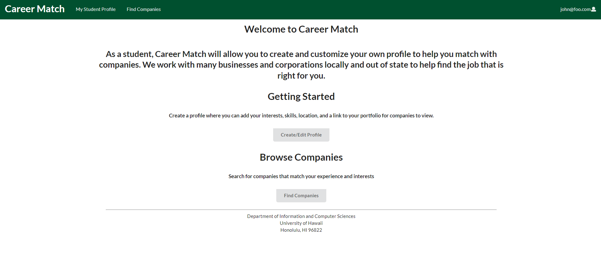
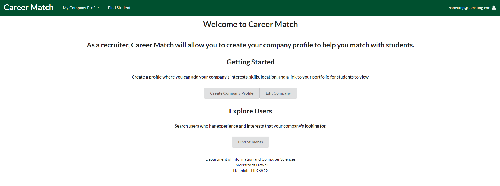
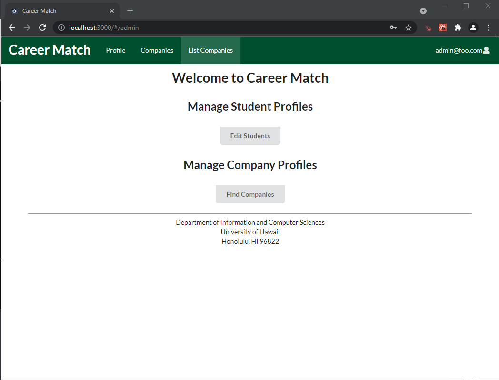
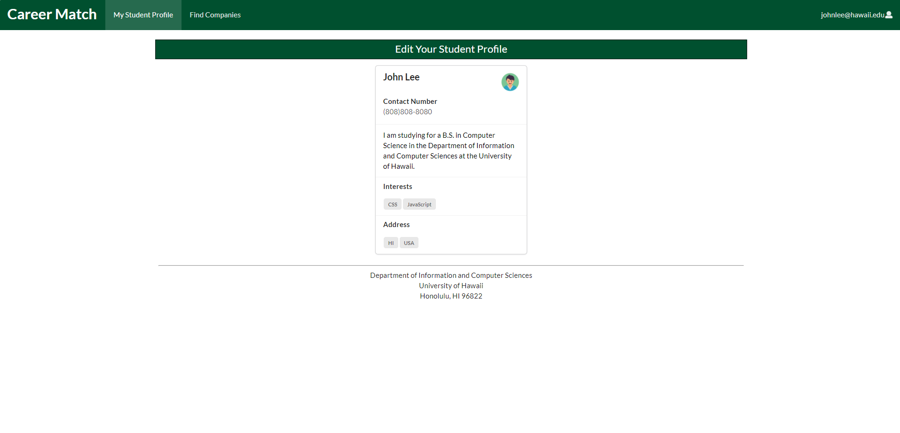
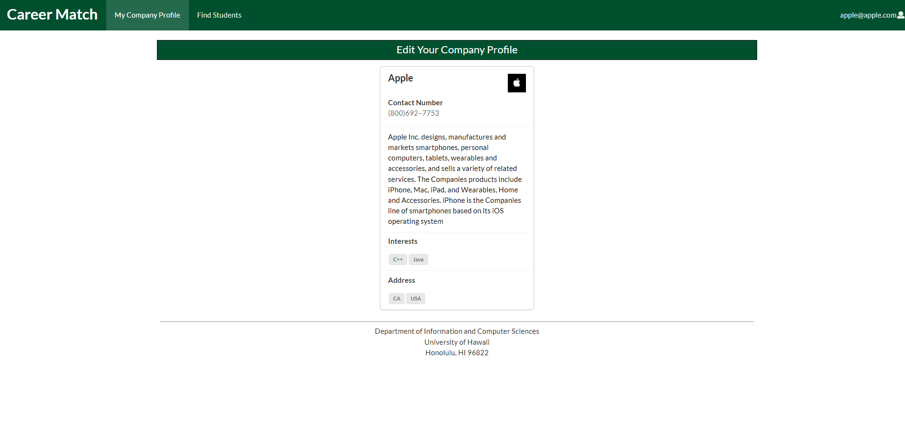
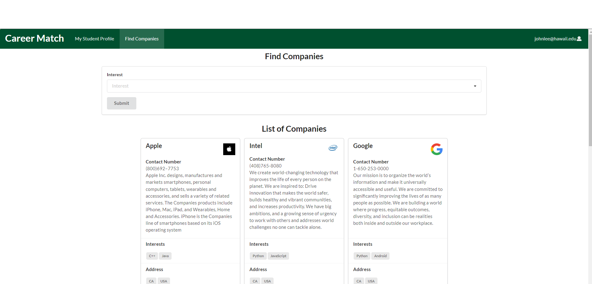

## Table of contents

- [Overview](#overview)
- [Deployment](#deployment)
- [User Guide](#user-guide)
- [Community Feedback](#community-feedback)
- [Developer Guide](#developer-guide)
- [Development History](#development-history)
- [Continuous Integration](#continuous-integration)
- [Contact Us](#contact-us)

## Overview 

Career Match provides a new way for connecting companies with a matching system. Students can select their skills to match with companies or browse companies with zip-code to find out geographic preference. The recruiter also can explore students’ profiles with the interest and skills that the company is looking for. The site can match students to employers and vice-versa.

Students who visit the site can create a profile with their interests (skills), preferred geographic location by zip-code, and link to their professional portfolio page. Admins can monitor the site for inappropriate content, and create new categories for the students and recruiters.
New user goes to landing page, logs in, gets home page, sets up profile.
Admin goes to landing page, logs in, gets home page, edits site.
User goes to landing page, logs in, finds companies with compatible interests, contacts them.
Recruiter goes to landing page, logs in, add company to Career Match, explore student’s profile.

The Github Organization for this project can be found [here](https://github.com/career-match/)

## Deployment

The latest version of the app is hosted [here](https://career-match.connectiveunconscious.com)

## User Guide

### Landing page
The landing page is the first page presented to the user. Helps with vistor to understand the features of the site.


### Student home page
The student home page is the page presented to the user who logged in as a student.



### Company home page
The company home page is the page presented to the user who logged in as a recruiter.



### Admin home page
The admin home page is the page for the admin.



### Student profile page
The student profile page is a page presented to the user with list of the profiles of students.



### Company profile page
The company profile page is a page presented to the user with a list of the profiles of the company with descriptions.



### Browse companies and users by skill, geographic preference
The page where users can search the companies by skills and geographic preference.

* will add the search field to browse it



## Community Feedback

We have not yet received feedback from the community regarding our app.

## Developer Guide

To build Career Match locally, first clone the career-match repository to your system:  
```bash
$ git clone https://github.com/career-match/career-match.git
```

Career Match uses [Meteor](https://www.meteor.com) which can be installed using npm with the command:  
```bash
$ npm install -g meteor
```

Install the dependencies using:  
```bash
$ cd career-match/app
$ meteor npm install
```

Build the app locally with:  
```bash
$ meteor npm run start
```

To use the locally built app, connect using a web browser to `http://localhost:3000`.

The app is designed to be deployed using [Meteor Up](http://meteor-up.com), which will have to be configured for the particular webserver you wish to host it on.

## Development History

The development process for Career Match conformed to [Issue Driven Project Management](http://courses.ics.hawaii.edu/ics314f19/modules/project-management/) practices. In a nutshell:

Development consists of a sequence of Milestones.
- Each Milestone is specified as a set of tasks.
- Each task is described using a GitHub Issue, and is assigned to a single developer to complete.
- Tasks should typically consist of work that can be completed in 2-4 days.
- The work for each task is accomplished with a git branch named “issue-XX”, where XX is replaced by the issue number.
- When a task is complete, its corresponding issue is closed and its corresponding git branch is merged into master.
- The state (todo, in progress, complete) of each task for a milestone is managed using a GitHub Project Board.

The following sections document the development history of Career Match.

### Milestone 1: Mockup development
The main goal of Milestone 1 was to create a set of HTML pages providing a mockup of the pages in the system.  

Milestone 1 was managed using [GitHub Project Board M1](https://github.com/career-match/career-match/projects/1)

### Milestone 2: Data model development
The main goal of Milestone 2 is to implement the data model: the underlying set of Mongo Collections and the operations upon them that would support the Career Match application.  

Milestone 2 is managed using [GitHub Project Board M2](https://github.com/career-match/career-match/projects/2)  


### Milestone 3: Final development

Milestone 3 is currently in progress.

Milestone 3 is managed using [GitHub Project Board M3](https://github.com/career-match/career-match/projects/3) 

## Continuous Integration
[](https://github.com/career-match/career-match/actions/workflows/ci.yml)

Career Match uses GitHub Actions to automatically run ESLint and TestCafe each time a commit is made to the default branch. You can see the results of all recent “workflows” at [https://github.com/career-match/career-match/actions](https://github.com/career-match/career-match/actions).

The workflow definition file is located at `.github/workflows/ci.yml`.

## Approach
Instead of sending out announcements each year, a company can create a page in the site that lists:  

- A brief overview of the company.
- Geographic location of the company.
- A list of positions that they commonly recruit for from new UH graduates. Each position has a brief description, a set of skills, whether it’s an internship, permanent position, or both, how many people they would like to hire, and salary range.
- Links to pages for additional information.
- Contact email(s) for followup.

Students who visit the site can create a profile with their interests (skills), preferred geographic location, and link to their professional portfolio page.  

Admins can monitor the site for inappropriate content, and create new categories of musical tastes, capabilities, and goals.  

## Contact Us
Career Match was designed and implemented by:
- [Cathy Kim](https://github.com/cathy-kim95)
- [Gerald Lee](https://github.com/glee25)
- [Ian Eshelman](https://github.com/IanEshelman)
- [Jay Ramos](https://github.com/ramosJay)
- [Stephanie Aelmore](https://github.com/believeinlain)
